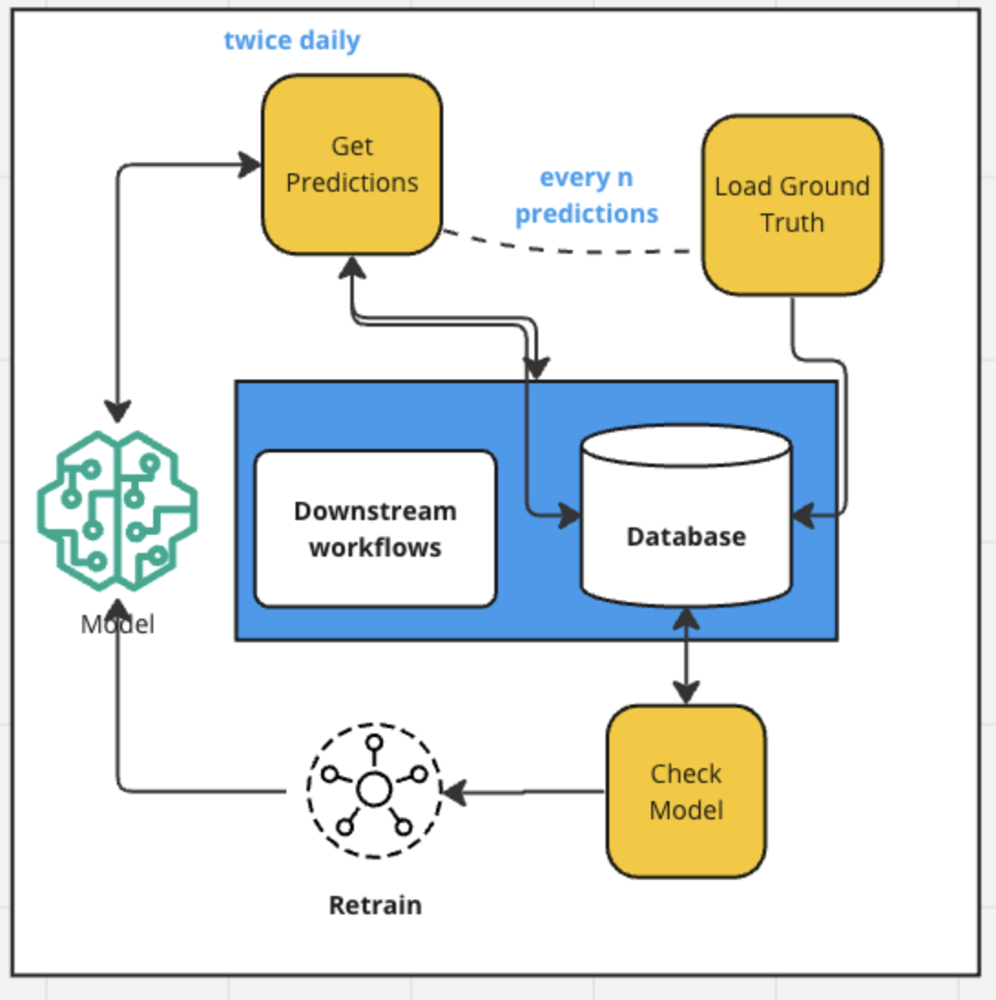

### Project overview

### Folder structure 

**data-clean** 
    - fills missing values
    - cleans host names (trims down)
    - removes zero only variables
    - removes single values 
    - remove error / packets fields

**eda file** 
    - looks at time series charts for all site / host combinations (at 5 min intervals)
    - looks at histograms/box plots/ correlation charts
    - removes initial set of site / host based on sparsity of spikes
    - aggregates to hour data & looks as same charts as above
    - removes a 2nd set of site/host combination based on lack of distribution

**model_lstm** 
    - includes feature identification
    - scaling / normalization
    - parameter set up
    - build 
     
**serve.py**
    - file used by CML model for model deploy
    - '5-min' forecasts with model based on 5 minute intevals
    - 'hourly' forecasts with model based on hourly data

### ML OPS Section 

**ml_flow_experiments.py**
    - use ml flow tracking to traing with experiments accross a range of paramaters
    - currently model signature is not rendering with tensorflow

#### Model monitoring code below is a simulation

The figure shows 3 jobs that handle model monitoring in a simulated scenario

**get_predictions.py**
    - Simulates rolling through time and make periodic forecasts.
    - with each step grabs a window of historic data, configures inputs and makes forecasts
    - predictions, as well as prediction metadata is saved
    - at configurable frequency, ground truth is loaded via api 
    - at configurable frequency, model monitoring logic is run to evaluate model performance
    - at model monitoring step, check model model job is kicked off

**check_model.py**
    - checks recent model performance for threshold rmse
    - if threshhold is breached next job, retrain, is kicked off 

**retrain.py**
    - retrains model
    - saves a time stamped model artifact
    - no ML flow included

**helper_functions.py**
    - houses tranformation functions for other scripts including model training. 

**train.py**
    - includes MLFLOW experiments integrated into training
    - v2 moves all functions to helper_functions.py 
    - v2 also adds api functionality for model registry

### existing issues

1. tracked aggregated  metrics needs update. Currently createing new recored
2. tracked delayed metrics is not loading ground truth for each record